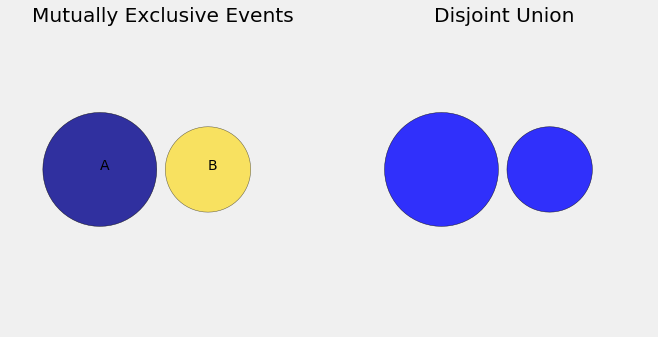
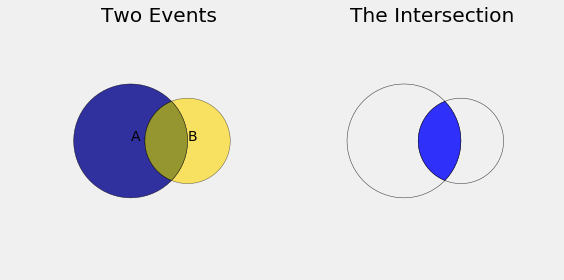

# 二、计算几率

一旦你开始处理概率问题，你很快就会意识到所有可能结果是等可能的假设并不总是合理的。例如，如果你认为硬币有偏差，那么你就不会认为它的正反面具有相同的几率。

为了处理一些情况，其中某些结果比其他结果几率更高，需要更普遍的理论。在 20 世纪 30 年代，俄罗斯数学家[安德烈科尔莫戈罗夫](https://en.wikipedia.org/wiki/Andrey_Kolmogorov)（Andrey Kolmogorov，1903-1987）提出了一些基本规则，称为公理，涵盖了丰富的情况，并成为现代概率论的基础。

公理从结果空间`Ω`开始。我们现在假设`Ω`是有限的。概率是一个定义在事件上的函数`P`，正如你所知，它是`Ω`的子集。前两个公理只是设置了度量的尺度：他们将概率定义为 0 和 1 之间的数字。

+   概率是非负的：对于每个事件`A`，$P(A) \ge 0$。
+   整个空间的概率为 1：$P(\Omega)= 1$。

第三个也是最后一个公理，它是概率成为事件“测度”的关键。在我们制定了一些相关术语后，我们会研究它。

## 加法

第三个公理关于互斥事件。非正式来讲，如果最多只有一个事件发生，则两个事件`A`和`B`是互斥的；换句话说，它们不能同时发生。

例如，假设你从一门课中随机抽取一名学生，其中 40% 的学生是新生，20% 是大二学生。每个学生既可以是大一学生，也可以是大二学生，也可以什么都不是；但没有一个学生既是大一学生，也是大二学生。所以如果`A`是“所选学生是新生”而`B`是事件“所选学生是二年级”的事件，则`A`和`B`是相斥的。

互斥事件有什么大不了的？要理解这一点，首先考虑所选学生是大一学生或大二学生的事件。在集合论的语言中，这是“新生”和“大二”两个事件的结合。使用维恩图来显示事件是一个好主意。在下图中，将`A`和`B`设想为两个互斥的事件，显示为蓝色和金色圆圈。因为事件是互斥的，所以相应的圆不重叠。并集是两个圆圈中所有点的集合。

```py
def show_disjoint_union():
    plt.figure(figsize=(10, 20))
    # create the circles with shapely
    a = sg.Point(1.4,2.5).buffer(1.0)
    b = sg.Point(3.3,2.5).buffer(0.75)


    # use descartes to create the matplotlib patches
    ax = plt.subplot(121)
    ax.add_patch(descartes.PolygonPatch(a, fc='darkblue', ec='k', alpha=0.8))
    ax.add_patch(descartes.PolygonPatch(b, fc='gold', ec='k', alpha=0.6))
    ax.annotate('A', [1.4, 2.5])
    ax.annotate('B', [3.3, 2.5])

    # control display
    plt.title('Mutually Exclusive Events')
    plt.axis('off')
    ax.set_xlim(0, 5); ax.set_ylim(0, 5)
    ax.set_aspect('equal')

    # use descartes to create the matplotlib patches
    ax = plt.subplot(122)
    ax.add_patch(descartes.PolygonPatch(a, fc='blue', ec='k', alpha=0.8))
    ax.add_patch(descartes.PolygonPatch(b, fc='blue', ec='k', alpha=0.8))

    # control display
    plt.title('Disjoint Union')
    plt.axis('off')
    ax.set_xlim(0, 5); ax.set_ylim(0, 5)
    ax.set_aspect('equal')
    
show_disjoint_union()
```



学生是大一或大二的几率是多少？ 在总体中，40% 是大一，20% 是大二，所以自然答案是 60%。 这是满足我们“大一或大二”标准的学生的百分比。 简单的加法是有效的，因为两组不相交。

科尔莫戈罗夫用这个想法来形成第三个，也是最重要的概率公理。正式来讲，如果交集为空，则`A`和`B`是互斥事件：

$A \cap B = \phi$

### 第三个公理，加法规则

在有限结果空间的背景下，公理表明：

+   如果`A`和`B`是互斥事件，那么 $P(A \cup B) = P(A) + P(B)$。

你将在练习中表明这个公理蕴涵着更一般的东西：

+   对于任何固定的`n`，如果 $A_1, A_2, \ldots, A_n$ 是互斥的（也就是对于所有 $i \ne j$，$A_i \cap A_j = \phi$），那么：

    $P\big{(} \bigcup_{i=1}^n A_i \big{)} = \sum_{i=1}^n P(A_i)$

    有时叫做有限可加性公理。
    
这个看似简单的公理具有巨大的力量，特别是当它扩展到无数个互斥的事件时。首先，它可以用来创建一些方便的计算工具。

### 嵌套事件

假设一个班级中有 50% 的学生将数据科学作为他们的专业之一，40% 的学生主修数据科学和计算机科学（CS）。 如果你随机选择一个学生，那么该学生主修数据科学，但不是 CS 的几率是什么？

下面的维恩图显示了一个对应于事件`A`（数据科学作为专业之一）的深蓝色圆圈，和一个对应`B`（主修数据科学和 CS）的金色圆圈（未按比例绘制）。这两个事件是嵌套的，因为`B`是`A`的一个子集：`B`中的每个人都把数据科学作为他们的专业之一。

所以 $B \subseteq A$，那些主修数据科学但不是 CS 的人是`A`与`B`的差：

$A - B = A \cap \bar B$

其中 $\bar B$ 是`B`的补集。差是右侧浅蓝色的圆圈。

```py
def show_difference():
    plt.figure(figsize=(10, 20))
    # create the circles with shapely
    a = sg.Point(2,2.5).buffer(1.0)
    b = sg.Point(2,2.5).buffer(0.75)

    # compute the 2 parts
    left = a.difference(b)
    middle = a.intersection(b)

    # use descartes to create the matplotlib patches
    ax = plt.subplot(121)
    ax.add_patch(descartes.PolygonPatch(left, fc='darkblue', ec='k', alpha=0.8))
    ax.add_patch(descartes.PolygonPatch(middle, fc='olive', ec='k', alpha=0.8))

    # control display
    plt.title('Nested Events')
    plt.axis('off')
    ax.set_xlim(0, 5); ax.set_ylim(0, 5)
    ax.set_aspect('equal')

    # use descartes to create the matplotlib patches
    ax = plt.subplot(122)
    ax.add_patch(descartes.PolygonPatch(left, fc='blue', ec='k', alpha=0.8))
    ax.add_patch(descartes.PolygonPatch(middle, fc='None', ec='k', alpha=0.8))

    # control display
    plt.title('The Difference')
    plt.axis('off')
    ax.set_xlim(0, 5); ax.set_ylim(0, 5)
    ax.set_aspect('equal')

show_difference()
```


这个学生在浅蓝色的差中的几率是多少呢？ 如果你回答“50% - 40% = 10%”，你是对的，你的直觉说概率的行为就像区域一样。他们是这样。 事实上，这个计算是从可加性的公理出发的，我们也通过查看这些区域来受它们启发。

### 减法规则

假设`A`和`B`是事件，$B \subseteq A$。那么 $P(A - B) = P(A) - P(B)$。

证明。由于 $B \subseteq A$，

$A = B \cup (A - B)$

这是个不相交集合，根据加法公理：

$P(A) = P(B) + P(A - B)$

所以，

$P(A - B) = P(A) - P(B)$

### 补集

如果一个事件的几率是 40%，它不会发生的几率是多少？ 60% 的“明显”答案是减法规则的特例。

#### 补集规则

对于任何事件`B`，$P(\bar B) = 1 - P(B)$。

证明。 下面的维恩图显示了要做什么。 在减法公式取`A = Ω`，记住第二个公理 $P(Ω)= 1$。或者，在这种特殊情况下为减法规则重新取参数。

```py
def show_complement():
    plt.figure(figsize=(10, 20))
    # create the square and circle with shapely
    a = sg.box(0, 0, 4.5, 4.5) 
    b = sg.Point(2.25,2.5).buffer(1)

    # compute the 2 parts
    left = a.difference(b)
    middle = a.intersection(b)

    # use descartes to create the matplotlib patches
    ax = plt.subplot(121)
    ax.add_patch(descartes.PolygonPatch(left, fc='None', ec='k', alpha=0.8))
    ax.add_patch(descartes.PolygonPatch(middle, fc='darkblue', ec='k', alpha=0.8))

    # control display
    plt.title('An Event (Square = Omega)')
    plt.axis('off')
    ax.set_xlim(0, 5); ax.set_ylim(0, 5)
    ax.set_aspect('equal')

    # use descartes to create the matplotlib patches
    ax = plt.subplot(122)
    ax.add_patch(descartes.PolygonPatch(left, fc='blue', ec='k', alpha=0.8))
    ax.add_patch(descartes.PolygonPatch(middle, fc='None', ec='k', alpha=0.8))

    # control display
    plt.title('The Complement')
    plt.axis('off')
    ax.set_xlim(0, 5); ax.set_ylim(0, 5)
    ax.set_aspect('equal')

show_complement()
```


当你在概率计算中看到减号时，就像在上面的补集规则中一样，你会经常发现减号是由于在附加规则的应用中，术语的重新排列。

当你加或减概率时，你就隐式地将一个事件分解成不相交的部分。这被称为划分事件，是需要掌握的一项基本的重要技术。在随后的章节中，您将看到很多划分的用法。

## 示例

让我们看看我们是否可以使用我们开发的结果来计算一些几率。一些步骤不计算也能清楚；其他东西需要更多的工作。

示例 1：`n`次投掷中的正面和反面

一枚硬币被抛出`n`次，以使所有 $2^n$ 种可能的正反面序列是等可能的。

问题。获得至少一个正面和至少一个反面的几率是多少？

回答。许多序列中每一面至少出现一次。例如，如果`n = 4`，则这样的序列包括`HTTT`，`HTHT`，`TTHT`等等。

方法 - 补集：当一个事件可能以多种不同的方式发生时，查看它不会发生的方式可能是一个好主意，因为这样情况较少。

对于`n = 4`，每个面没有至少出现一次的唯一序列是`HHHH`和`TTTT`。事实上，对于任何`n`，只有两个序列，我们不能从中得到两个面：所有都是正面和所有都是反面。这些是所有元素都相同的两个序列。

让`A`成为事件“我们得到至少一个正面和至少一个反面”。问题要求`P(A)`。因为 $\bar A$ 是事件“序列的所有元素都相同”，所以我们有：

$P(\bar A) = \frac{2}{2^n} = \frac{1}{2^{n-1}}$

根据补集规则：

$P(A) = 1 - \frac{1}{2^{n-1}}$

请注意，随着`n`变大，答案趋于 1。随着大量的投掷，你几乎肯定可以看到正面和反面。

## 示例 2：骰子的 12 次投掷的最大值

一个骰子投掷了 12 次，所以所有 $6^12$ 个点数序列是等可能的。将 12 个投掷的最大值定义为 12 个点数中出现的最大值。 例如，序列`354222143351`的最大值是 5。

问题 1。最大值小于 5 的概率是多少？

答案 1。关键是观察事件“最大值小于 5”与事件“所有 12 个面都小于 5”相同。 为了发生这种情况，12 个点数中的每一个都必须具有四个值 1 到 4 之一。所以：

$P(\text{maximum is less than 5}) = \frac{4^{12}}{6^{12}}$

是的，我们可以进一步简化，但我们不打算，因为很快就会明白原因。

问题 2。最大值小于 4 的概率是多少？

答案 2。这里没有什么新东西，除了在问题 1 中将 5 替换成 4。

$P(\text{maximum is less than 4}) = \frac{3^{12}}{6^{12}}$

问题 3。最大值等于 4 的概率是多少？

答案 3：写下所有最大值等于 4 的序列的并不容易。 让我们看看，我们是否可以使用我们已经知道的。 最大值等于 4：

最大值必须小于 5，
并且不能小于 4。

我们将集合`{4}`看作一个差：`{1,2,3,4} - {1,2,3}`。

所以通过减法规则，

$\begin{align*} P(\text{maximum is equal to 4}) &= P(\text{maximum is less than 5}) - P(\text{maximum is less than 4}) \\ &= \frac{4^{12}}{6^{12}} - \frac{3^{12}}{6^{12}} \end{align*}$

12 次投掷没有什么特别之处。你可以在整个过程中用`n`代替 12，并且参数将如上所述。

最大值是一个极值的例子，另一个是最小值。

解决问题的技巧：当你使用极值时，请记住我们在本例中使用的观察结果：说最大值很小等同于说所有元素都很小。类似地，说最小值很大等同于说所有元素都很大。

### 示例 3：大于第一个随机数的第二个随机数

一个随机数生成器产生两个数字，因此所有 100 对数字都是等可能的。

问题。第二位数字大于第一位的可能性是多少？

答案，方法一 - 划分：制定事件发生的所有方式的组织清单。 列出第二个数字大于第一个数字的一个好方法是，根据第一个数字的值来划分它们：

+   第一位数字 0，第二位 1 到 9
+   第一位数字 1，第二位 2 到 9
+   第一位数字 2，第二位 3 到 9
+   等等，直到
+   第一位数字 8，第二位 9

这个划分使其很容易计算，在 100 个可能的偶对中，第二个数字大于第一个数字的所有偶对：有`9 + 8 + 7 + 6 + 5 + 4 + 3 + 2 + 1 = (9×10) / 2 = 45`种。所以答案是 0.45。

答案，方法二 - 对称性：用一些对称性说服自己：第二个数字大于第一个数字的几率与第一个数字大于第二个数字的几率相同。一种方法是根据第二个数字的值，来划分第二个事件，并注意与方法一中的划分的对应关系。

所以如果 $p = P(\text{second digit is greater than the first})$，加法规则表明：

$\begin{align*} 1 &= P(\text{first digit is greater than the second}) + P(\text{the two digits are equal}) + P(\text{second digit is greater than the first}) \\ &= p + \frac{10}{100} + p \end{align*}$

因为有 10 对相等的数字：`00, 11, 22, ..., 99`。现在求解`p`：

$p = \frac{1 - 0.1}{2} = 0.45$

像之前一样。

学习这两种方法是一个好主意。划分和对称将在整个课程中使用。

## 乘法

概率的主要公理有关互斥事件，事实证明，我们不需要任何其他公理来处理相交的事件。

```py
def show_intersection():
    plt.figure(figsize=(8, 16))
    # create the circles with shapely
    a = sg.Point(-.5,0).buffer(1.0)
    b = sg.Point(0.5,0).buffer(0.75)

    # compute the 3 parts
    left = a.difference(b)
    right = b.difference(a)
    middle = a.intersection(b)

    # use descartes to create the matplotlib patches
    ax = plt.subplot(121)
    ax.add_patch(descartes.PolygonPatch(left, fc='darkblue', ec='k', alpha=0.8))
    ax.add_patch(descartes.PolygonPatch(right, fc='gold', ec='k', alpha=0.6))
    ax.add_patch(descartes.PolygonPatch(middle, fc='olive', ec='k', alpha=0.8))
    ax.annotate('A', [-0.5, 0])
    ax.annotate('B', [0.5, 0])

    # control display
    plt.title('Two Events')
    plt.axis('off')
    ax.set_xlim(-2, 2); ax.set_ylim(-2, 2)
    ax.set_aspect('equal')

    # use descartes to create the matplotlib patches
    ax = plt.subplot(122)
    ax.add_patch(descartes.PolygonPatch(left, fc='None', ec='k', alpha=0.8))
    ax.add_patch(descartes.PolygonPatch(right, fc='None', ec='k', alpha=0.8))
    ax.add_patch(descartes.PolygonPatch(middle, fc='blue', ec='k', alpha=0.8))

    # control display
    plt.title('The Intersection')
    plt.axis('off')
    ax.set_xlim(-2, 2); ax.set_ylim(-2, 2)
    ax.set_aspect('equal')
    
show_intersection()
```



让`A`和`B`为两个事件。 交集`A ∩ B`是`A`和`B`都是发生的事件，右侧的维恩图中以亮蓝色显示。

因为我们会一直遇到交集，所以在我们的表示法中我们会有点偷懒：我们将使用`AB`来表示交集，而不会写入交集符号`∩`。你必须记住`AB`是一个事件，而不是乘积。

这里有一个例子可以帮助解释我们即将制定的一些定义。

### 无放回随机抽取

