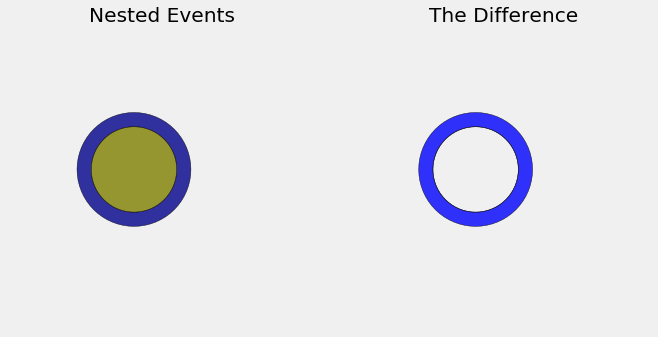
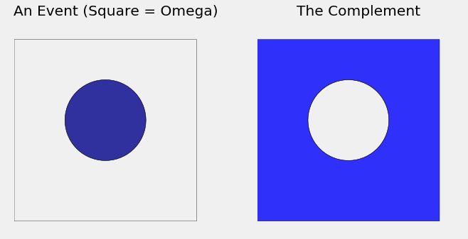

# 二、计算几率

一旦你开始处理概率问题，你很快就会意识到所有可能结果是等可能的假设并不总是合理的。例如，如果你认为硬币有偏差，那么你就不会认为它的正反面具有相同的几率。

为了处理一些情况，其中某些结果比其他结果几率更高，需要更普遍的理论。在 20 世纪 30 年代，俄罗斯数学家[安德烈科尔莫戈罗夫](https://en.wikipedia.org/wiki/Andrey_Kolmogorov)（Andrey Kolmogorov，1903-1987）提出了一些基本规则，称为公理，涵盖了丰富的情况，并成为现代概率论的基础。

公理从结果空间 Ω 开始。我们现在假设 Ω 是有限的。概率是一个定义在事件上的函数 P，正如你所知，它是 Ω 的子集。前两个公理只是设置了度量的尺度：他们将概率定义为 0 和 1 之间的数字。

+   概率是非负的：对于每个事件 A，$P(A) \ge 0$。
+   整个空间的概率为 1：$P(\Omega)= 1$。

第三个也是最后一个公理，它是概率成为事件“测度”的关键。在我们制定了一些相关术语后，我们会研究它。

## 加法

第三个公理关于互斥事件。非正式来讲，如果最多只有一个事件发生，则两个事件 A 和 B 是互斥的；换句话说，它们不能同时发生。

例如，假设你从一门课中随机抽取一名学生，其中 40% 的学生是新生，20% 是大二学生。每个学生既可以是大一学生，也可以是大二学生，也可以什么都不是；但没有一个学生既是大一学生，也是大二学生。所以如果 A 是“所选学生是新生”而 B 是事件“所选学生是二年级”的事件，则 A 和 B 是相斥的。

互斥事件有什么大不了的？要理解这一点，首先考虑所选学生是大一学生或大二学生的事件。在集合论的语言中，这是“新生”和“大二”两个事件的结合。使用维恩图来显示事件是一个好主意。在下图中，将 A 和 B 设想为两个互斥的事件，显示为蓝色和金色圆圈。因为事件是互斥的，所以相应的圆不重叠。并集是两个圆圈中所有点的集合。

```py
def show_disjoint_union():
    plt.figure(figsize=(10, 20))
    # create the circles with shapely
    a = sg.Point(1.4,2.5).buffer(1.0)
    b = sg.Point(3.3,2.5).buffer(0.75)


    # use descartes to create the matplotlib patches
    ax = plt.subplot(121)
    ax.add_patch(descartes.PolygonPatch(a, fc='darkblue', ec='k', alpha=0.8))
    ax.add_patch(descartes.PolygonPatch(b, fc='gold', ec='k', alpha=0.6))
    ax.annotate('A', [1.4, 2.5])
    ax.annotate('B', [3.3, 2.5])

    # control display
    plt.title('Mutually Exclusive Events')
    plt.axis('off')
    ax.set_xlim(0, 5); ax.set_ylim(0, 5)
    ax.set_aspect('equal')

    # use descartes to create the matplotlib patches
    ax = plt.subplot(122)
    ax.add_patch(descartes.PolygonPatch(a, fc='blue', ec='k', alpha=0.8))
    ax.add_patch(descartes.PolygonPatch(b, fc='blue', ec='k', alpha=0.8))

    # control display
    plt.title('Disjoint Union')
    plt.axis('off')
    ax.set_xlim(0, 5); ax.set_ylim(0, 5)
    ax.set_aspect('equal')
    
show_disjoint_union()
```


学生是大一或大二的几率是多少？ 在总体中，40% 是大一，20% 是大二，所以自然答案是 60%。 这是满足我们“大一或大二”标准的学生的百分比。 简单的加法是有效的，因为两组不相交。

科尔莫戈罗夫用这个想法来形成第三个，也是最重要的概率公理。正式来讲，如果交集为空，则 A 和 B 是互斥事件：

$A \cap B = \phi$

### 第三个公理，加法规则

在有限结果空间的背景下，公理表明：

+   如果 A 和 B 是互斥事件，那么 $P(A \cup B) = P(A) + P(B)$。

你将在练习中表明这个公理蕴涵着更一般的东西：

+   对于任何固定的 n，如果 $A_1, A_2, \ldots, A_n$ 是互斥的（也就是对于所有 $i \ne j$，$A_i \cap A_j = \phi$），那么：

    $P\big{(} \bigcup_{i=1}^n A_i \big{)} = \sum_{i=1}^n P(A_i)$

    有时叫做有限可加性公理。
    
这个看似简单的公理具有巨大的力量，特别是当它扩展到无数个互斥的事件时。首先，它可以用来创建一些方便的计算工具。

### 嵌套事件

假设一个班级中有 50% 的学生将数据科学作为他们的专业之一，40% 的学生主修数据科学和计算机科学（CS）。 如果你随机选择一个学生，那么该学生主修数据科学，但不是 CS 的几率是什么？

下面的维恩图显示了一个对应于事件 A（数据科学作为专业之一）的深蓝色圆圈，和一个对应 B（主修数据科学和 CS）的金色圆圈（未按比例绘制）。 这两个事件是嵌套的，因为 B 是 A 的一个子集：B 中的每个人都把数据科学作为他们的专业之一。

所以 $B \subseteq A$，那些主修数据科学但不是 CS 的人是 A 与 B 的差：

$A - B = A \cap \bar B$

其中 $\bar B$ 是 B 的补集。差是右侧浅蓝色的圆圈。

```py
def show_difference():
    plt.figure(figsize=(10, 20))
    # create the circles with shapely
    a = sg.Point(2,2.5).buffer(1.0)
    b = sg.Point(2,2.5).buffer(0.75)

    # compute the 2 parts
    left = a.difference(b)
    middle = a.intersection(b)

    # use descartes to create the matplotlib patches
    ax = plt.subplot(121)
    ax.add_patch(descartes.PolygonPatch(left, fc='darkblue', ec='k', alpha=0.8))
    ax.add_patch(descartes.PolygonPatch(middle, fc='olive', ec='k', alpha=0.8))

    # control display
    plt.title('Nested Events')
    plt.axis('off')
    ax.set_xlim(0, 5); ax.set_ylim(0, 5)
    ax.set_aspect('equal')

    # use descartes to create the matplotlib patches
    ax = plt.subplot(122)
    ax.add_patch(descartes.PolygonPatch(left, fc='blue', ec='k', alpha=0.8))
    ax.add_patch(descartes.PolygonPatch(middle, fc='None', ec='k', alpha=0.8))

    # control display
    plt.title('The Difference')
    plt.axis('off')
    ax.set_xlim(0, 5); ax.set_ylim(0, 5)
    ax.set_aspect('equal')

show_difference()
```



这个学生在浅蓝色的差中的几率是多少呢？ 如果你回答“50% - 40% = 10%”，你是对的，你的直觉说概率的行为就像区域一样。他们是这样。 事实上，这个计算是从可加性的公理出发的，我们也通过查看这些区域来受它们启发。

### 减法规则

假设 A 和 B 是事件，$B \subseteq A$。那么 $P(A - B) = P(A) - P(B)$。

证明。由于 $B \subseteq A$，

$A = B \cup (A - B)$

这是个不相交集合，根据加法公理：

$P(A) = P(B) + P(A - B)$

所以，

$P(A - B) = P(A) - P(B)$

### 补集

如果一个事件的几率是 40%，它不会发生的几率是多少？ 60% 的“明显”答案是减法规则的特例。

#### 补集规则

对于任何事件 B，$P(\bar B) = 1 - P(B)$。

证明。 下面的维恩图显示了要做什么。 在减法公式取 A = Ω，记住第二个公理 $P(Ω)= 1$。或者，在这种特殊情况下为减法规则重新取参数。

```py
def show_complement():
    plt.figure(figsize=(10, 20))
    # create the square and circle with shapely
    a = sg.box(0, 0, 4.5, 4.5) 
    b = sg.Point(2.25,2.5).buffer(1)

    # compute the 2 parts
    left = a.difference(b)
    middle = a.intersection(b)

    # use descartes to create the matplotlib patches
    ax = plt.subplot(121)
    ax.add_patch(descartes.PolygonPatch(left, fc='None', ec='k', alpha=0.8))
    ax.add_patch(descartes.PolygonPatch(middle, fc='darkblue', ec='k', alpha=0.8))

    # control display
    plt.title('An Event (Square = Omega)')
    plt.axis('off')
    ax.set_xlim(0, 5); ax.set_ylim(0, 5)
    ax.set_aspect('equal')

    # use descartes to create the matplotlib patches
    ax = plt.subplot(122)
    ax.add_patch(descartes.PolygonPatch(left, fc='blue', ec='k', alpha=0.8))
    ax.add_patch(descartes.PolygonPatch(middle, fc='None', ec='k', alpha=0.8))

    # control display
    plt.title('The Complement')
    plt.axis('off')
    ax.set_xlim(0, 5); ax.set_ylim(0, 5)
    ax.set_aspect('equal')

show_complement()
```



当你在概率计算中看到减号时，就像在上面的补集规则中一样，你会经常发现减号是由于在附加规则的应用中，术语的重新排列。

当你加或减概率时，你就隐式地将一个事件分解成不相交的部分。这被称为划分事件，是需要掌握的一项基本的重要技术。在随后的章节中，您将看到很多划分的用法。

