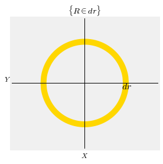
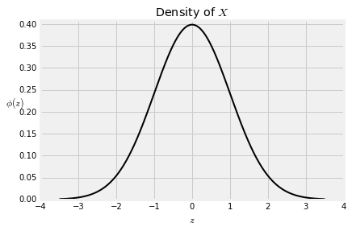
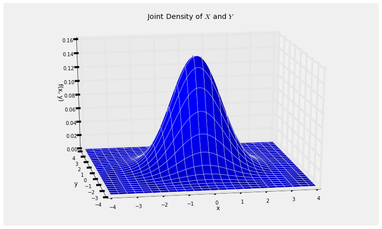
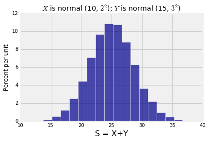

# 18. 正态和伽马分布族

```python
# HIDDEN
from datascience import *
from prob140 import *
import numpy as np
import matplotlib.pyplot as plt
plt.style.use('fivethirtyeight')
%matplotlib inline
import math
from scipy import stats
```

正态分布族在概率论和数据科学中有独一无二的地位。在你理解更多正式的概率论之前，你就开始使用Data 8中的正态分布。所以，你已经将几个基本事实视为理所当然而无需证明。这章我们将开始研究并建立这些事实，同时研究独立正态分布变量的和的问题。

至于伽马分布族，通过练习题进行研究的特性出现在了许多的场景中。举一个例子，你已经证明指数分布属于伽马分布族，就像属于标准正态分布的变量的平方一样。稍后在这章，我们将收集我们知道的关于伽马分布族的内容以及看看在独立伽马分布的变量平方中能挖掘到什么样的东西。

## 18.1 标准正态分布：基础

尽管自从Data 8我们已经接受标准正态分布的密度函数，我们还没有证明它的确是一个密度函数-积分为1。我们也没有检查它的期望是否存在，也没有检查它的标准差的确为1。

现在是时候完成这些了，只有这样才能确保我们关于正态分布密度的计算是合理的。

在开始的地方我们需要回忆一些关于不相关的瑞利分布的事实，我们曾经在研究指数分布的平方根的分布的时候遇见过。

假定$T$服从参数为$1/2$的指数分布。那么我们可以说$R=\sqrt T$就是一个瑞利分布，并且其累计分布函数为
$$
F_R(r) = 1 - e^{-\frac{1}{2}r^2}, ~~~~ r > 0
$$
同时其密度函数为
$$
f_R(r) = re^{-\frac{1}{2}r^2}, ~~~~ r > 0
$$
事实上，存在一个瑞利分布族，其中每一个都有着$cR$的分布($c$是常数)。但是让我们定义$R$就是唯一的瑞利分布，然后研究$R$是如何与标准正态分布联系起来。

### The Constant of Integration

假定$X$和$Y$是相互独立的标准正态分布变量。因为我们还没有证明标准正态分布的密度函数中积分为$1/\sqrt 2$的常数，现在暂定其为$c$。然后，$X$和$Y$的联合分布密度为
$$
f(x, y) ~ = ~ c e^{-\frac{1}{2}x^2} \cdot c e^{-\frac{1}{2}y^2} 
~ = ~ c^2 e^{-\frac{1}{2}(x^2 + y^2)},
~~~~ -\infty < x, y < \infty
$$
不管这个常数的具体值，这个联合分布拥有圆对称性。如果两个点在与原点相同径向距离的平面上，那么这个联合密度在这两个点上是一样的。现在使用另外的记号来使这一结论更清晰。
$$
f(x, y) ~ = ~ c^2 e^{-\frac{1}{2}r^2} ~~~~ \text{where } x^2 + y^2 = r^2
$$
现在假定$R = \sqrt{X^2 + Y^2}$。为了找到$R$的密度，现在尝试计算$P(R\in dr)$。这个事件在下图中展示。

```python
# NO CODE
x = np.append(np.arange(-1, 0.999, 0.01), 1)
y = (1 - x**2)**0.5
plt.plot(x, y, color='gold', lw=10)
y2 = -1*y
plt.plot(x, y2, color='gold', lw=10)
plt.plot([-1.8, 1.8], [0, 0], color='k', lw=1)
plt.plot([0, 0], [-1.8, 1.8], color='k', lw=1)
plt.xlim(-1.8, 1.8)
plt.ylim(-1.6, 1.6)
plt.xticks([])
plt.yticks([])
plt.text(0.9, -0.15, '$dr$', size=16)
plt.xlabel('$X$')
plt.ylabel('$Y$', rotation=0)
plt.title('$\{R \in dr \}$')
plt.axes().set_aspect('equal');
```



为了得到联合密度曲面下的相关体积，两个观察会有帮助。

- 由于具有圆对称性，联合密度曲面在整个黄色的圆环上都是同一高度，且高度为$c^2e^{-\frac{1}{2}r^2}$。
- 圆环的区域基本上等价于一个矩形，且矩形宽为$dr$，长等于周长$2\pi r$。

因此，
$$
P(R \in dr) ~ \sim ~ 2\pi r \cdot dr \cdot c^2e^{-\frac{1}{2}r^2}, ~~~~ r > 0
$$
所以$R$的密度函数为
$$
f_R(r) ~ = ~ 2\pi c^2 r e^{-\frac{1}{2}r^2}, ~~~~ r > 0
$$
将这个密度函数与瑞利分布的密度函数比较。这两者是一样的除了常数部分不同。瑞利分布的常数为1而对于新的$R$分布，其常数为$2\pi ^2c$。但是由于两个函数是等价的，因此常数部分也必定相同。因此$1=2\pi c^2$，这就意味着
$$
c = \frac{1}{\sqrt{2\pi}}
$$
现在我们知道标准正态分布的密度函数$\phi$也是一个密度函数，
$$
\phi(z) ~ = ~ \frac{1}{\sqrt{2\pi}} e^{-\frac{1}{2}z^2}, ~~~~ -\infty < z < \infty
$$

```python
# NO CODE
z = np.arange(-3.5, 3.51, 0.01)
phi = stats.norm.pdf(z)
plt.plot(z, phi, color='k', lw=2)
plt.ylim(0, 0.41)
plt.title('Density of $X$')
plt.xlabel('$z$')
plt.ylabel('$\phi(z)$', rotation=0);
```



```python
def indep_standard_normals(x,y):
    return 1/(2*math.pi) * np.exp(-0.5*(x**2 + y**2))

Plot_3d((-4, 4), (-4, 4), indep_standard_normals, rstride=4, cstride=4)
plt.title('Joint Density of $X$ and $Y$');
```



**期望**

如果$Z$服从标准正态分布且$E(Z)$存在，那么$E(Z)$必须关于$0$对称。但是你已经在习题中看到并不是所有的对称函数都有期望，柯西函数就是其中一个例子。为了确保$E(Z)=0$，我们必须首先确保$E(|Z|)$是有限的。
$$
\begin{align*}
E(\lvert Z \rvert) &= \int_{-\infty}^\infty \lvert z \rvert \phi(z)dz \\ \\
&= 2 \int_0^\infty z \phi(z)dz ~~~~ \text{(symmetry)} \\ \\
&= \frac{2}{\sqrt{2\pi}} \int_0^\infty z e^{-\frac{1}{2}z^2} dz \\ \\
&= \frac{2}{\sqrt{2\pi}} ~~~~~~ \text{(Rayleigh density integrates to 1)} \\ \\
&= \sqrt{\frac{2}{\pi}}
\end{align*}
$$
我们不止证明了$E(|Z|)$的值是有限的，因此$E(Z)=0$，同时我们还得到了$E(|Z|)$的具体值。

**方差**

如果$X$和$Y$是独立的标准正态分布变量，我们已经证明了$R = \sqrt{X^2 + Y^2}$就是瑞利分布。

同时也知道了瑞利分布能够作为参数$1/2$的指数分布的平方根的分布出现。

紧接着，如果$X$和$Y$是独立的标准正态分布变量，那么$X^2 + Y^2$就是服从参数$1/2$的指数分布。

在后面的章节我们会对这些进行更深入的研究。至此，让我们总结两个关于期望的观察结果。

- $X^2 + Y^2$服从参数$1/2$的指数分布，因此$E(X^2 + Y^2) = 2$。
- $X$和$Y$服从完全一样的分布，因此$E(X^2) = E(Y^2)$。

综上，$E(X^2)=1$。我们知道$E(X)=0$，因此$Var(X) = 1$且$SD(X) = 1$。


## 18.2 独立正态分布变量的和

基于以下事实，这一节将包含多个例子：

**独立正态分布变量的和同样服从正态分布**

我们将会在下一节使用矩母函数证明这一观点。而现在，我们将进行一个快速的模拟并观察如何在例子中利用这一事实。

```python
mu_X = 10
sigma_X = 2
mu_Y = 15
sigma_Y = 3
x = stats.norm.rvs(mu_X, sigma_X, size=10000)
y = stats.norm.rvs(mu_Y, sigma_Y, size=10000)
s = x+y
Table().with_column('S = X+Y', s).hist(bins=20)
plt.title('$X$ is normal (10, $2^2$); $Y$ is normal (15, $3^2$)');
```



上面的仿真随机生成了$10,000$个样本$X+Y$，其中$X$服从均值为$10$，标准差为$2$的正态分布，$Y$独立于$X$且其服从均值为$15$，标准差为$3$的正态分布。由结果可以清楚地看出两者和服从正态分布。你可以改变参数然后检查和的分布是否是一样的形状，尽管坐标轴的标签不一样。

为了确认是否真的是正态分布，你必须算出和的均值和方差。这里仅仅使用均值和方差的特性：

如果$X$服从$(\mu_X, \sigma_X^2)$的正态分布，$Y$独立于$X$且服从$(\mu_Y, \sigma_Y^2)$的正态分布，那么$X+Y$也是正态分布且均值为$\mu_X + \mu_Y$，方差为$\sigma_X^2 + \sigma_Y^2$。

这意味着我们不需要$X$和$Y$的联合密度就能得到$X+Y$事件的概率。